# DemoEditor sample information system

This is the sample application that comes with the book `Enterprise Architecture with .NET`, published by Packt. It is a system composed with several services that can be run together using Docker Compose. Some of the services are existing images, some are provided as custom, .NET-based, API-compatible, services.

## Context

**DemoEditor** is a sample company that is supposed to edit books. As such, it needs a data referential services for books, which is in `books-controller`, another one for authors, which is in `authors-controller`, and a portal application to exploit these data providers and add some business process. This application is a Blazor Web Assembly Single-Page Application, provided in the `portal-gui` folder. A mobile application based on MAUI is also provided for reference, but we will only show the installation of the web platform. The rest of the dependencies will be provided in the `docker-compose.yml` file.

## Caveat

The book is definitely not about programming. In fact, it is quite the contrary, as the method exposed in it insists on the importance of the right definition of services and API contracts, the respect of separation of responsibility and the use of norms and standards for interface, stating that those are more important than the code implementation itself. You will thus find lots of C# bits of code that are sub-optimal, or even quick-and-dirty versions of a method. **This is done on purpose**, both to stress the importance of the code structure rather than its execution details, and to give the readers opportunities to verify that adjusting implementations indeed does not impact the architecture in itself, owing to the right cutting of services, in alignment to the business functions.

This is of course not to say that I am against code improvements and I will be more than happy to receive any pull requests and possibly integrate them as examples of better implementations that are made easy by a solid initial architecture.

## Versioning

**It is extremely important that you choose the right version if you want to use the present code to check how things presented in the book actually work.** Versions before 1.0 are there to show the progressive building of the information system; refer to them if you want to see simple code for a particular use. Version 1.0 is targeted as the version that correspond to the state of the system at the end of the book, with all parts working together; run this version if you want to have almost everything explained in the book running at once, but still without any sophistication. Versions following 1.0 will be added to make the code cleaner, add some options that have not been shown or discussed in the book, etc. Since they will be more sophisticated and configurable, they might become a bit more difficult to read and associate with the book, so only refer to them if you want to know about possible improvements from what the book concentrated on (which, again, is definitely not the technical preciseness, but the right alignment of the technology on the business).

The sample application follows versions that hopefully make it easier to read the book chapters and associate them with different steps in the construction of the information system:
- Branch [v0.1](https://github.com/PacktPublishing/Enterprise-Architecture-with-.NET/tree/v0.1/DemoEditor) corresponds to a **very simple form of the application**, with only the two APIs working and a basic portal, both **without any authentication mechanism** in order to ease use as a demo of the data referential services and overall comprehension of the concepts.
- Branch [v0.2](https://github.com/PacktPublishing/Enterprise-Architecture-with-.NET/tree/v0.2/DemoEditor) adds the **authentication and authorization management** to the application (both frontend and backend) using a Keycloak IAM server. It also adds the batch import of data, using a Docker volume.
- Branch [v0.3](https://github.com/PacktPublishing/Enterprise-Architecture-with-.NET/tree/v0.3/DemoEditor) shows the implementation of a business process for the book creation. Rather than simply adding an entity, this process progressively enhances the structure of the book. This version also adds a webhook mechanism that updates the locally-duplicated attributes of the main author of a book when this author is modified.
- Branch [v0.4](https://github.com/PacktPublishing/Enterprise-Architecture-with-.NET/tree/v0.4/DemoEditor) adds two services. The first one is based on MailHog and sends invites to prospect authors for a new book. The second one is a custom Middle Office so that prospect users can indicate whether they accept of reject this invite.
- Branch [v0.5](https://github.com/PacktPublishing/Enterprise-Architecture-with-.NET/tree/v0.5/DemoEditor) introduces the notification service and points the existing services to this new tool. As a side-effect, this version also brings the feature of auto-provisionning of users on the corresponding server.
- Branch [v0.6](https://github.com/PacktPublishing/Enterprise-Architecture-with-.NET/tree/v0.6/DemoEditor) goes further in the business process choreography by adding a webhook callback when an author is chosen, which in turns generates a contract in the Electronic Document Management service. Since this exchange of contract needs some hard delivery robustness, we will introduce a Message-Oriented Middleware at this step. **Warning: the IAM service switches from port 8080 to 8088 in this version (see explanation below).**
- Branch [main](https://github.com/PacktPublishing/Enterprise-Architecture-with-.NET/tree/main/DemoEditor) is the most up-to-date version of the application, with **maximum content, including applications from all chapters** of the book (and thus highest level of complexity for a full installation) **but also additional content that is outside the scope of the book**. Use this version if you want to follow the future works of the author on this sample information system.

## Prerequisites

Docker has been used in order to reduce as much as possible the required tooling. Since all images are available online (even the custom ones created for the sample information system, available at `https://hub.docker.com/repositories/demoeditor`), all you need to work with the application is Docker (see https://docs.docker.com/engine/install/ for installation instructions). The images versions follow the branches of the code.

If you want to debug the application, make some changes to it in order to follow the instructions from the book, then you will also need .NET 8.0 SDK (https://dotnet.microsoft.com/download), Visual Studio Code (https://code.visualstudio.com/download), and Git (https://git-scm.com/book/en/v2/Getting-Started-Installing-Git). Postman (https://www.postman.com/) will also be used as an option to quickly inject data.

## Installation

Even if everything is installed in the local machine, it makes it much easier to use aliases, so you will need to edit your `hosts` file (`/etc/hosts` for Linux, `C:\Windows\System32\drivers\etc\hosts` for Windows) and add the following lines:

```
127.0.0.1 iam
127.0.0.1 portal
127.0.0.1 authors
127.0.0.1 books
127.0.0.1 mail
127.0.0.1 middleoffice
127.0.0.1 users
127.0.0.1 edm
127.0.0.1 mom
```

In order to avoid as much network conflicts as possible, the main application is exposed on port 88 instead of the default port 80. No HTTPS is used, again with the objective of simplifying as much as possible the deployment of the sample information system.

If you use the command line to retrieve the necessary files (you may also download the corresponding compressed package from the Github interface), you will need to use the following operations:

```
git clone https://github.com/PacktPublishing/Enterprise-Architecture-with-.NET
git checkout v0.5
```

Running the application is then as simple as launching Docker Compose on the right file:

```
cd DemoEditor
docker compose up -d
```

## External Electronic Document Management system (option)

Starting in version 0.6, we also install an Alfresco system. Since this uses quite a lot of resources and its use is anecdotical in the sample (basically just to show how to correctly externalize document management), this is left to a separate Docker Compose installation. The file used can be obtained at https://github.com/Alfresco/acs-deployment/blob/master/docker-compose/community-docker-compose.yml and a copy is provided at the root of the present repository.

As this complex Docker Compose defines port 8080 as its principal exposition and uses it in most of its services, internally as well as externally, it has been decided to switch the Apache Keycloak IAM exposition port to 8088 to avoid conflict. The documentation has been changed accordingly, and the code remains as such, except for the accesses from the Single Page Application that have been modified. The Postman collection file has also been updated. The server calls remain the same because they use internal ports, all services inside Docker Compose being on shared networks. Note that you will have to recreate your users when changing the IAM port, and that notifications to the old users will be lost (it may be better to clear the whole `users` collection in the database).

To run the Alfresco set of services, use the following command:

```
docker compose -f alfresco-community-docker-compose.yml up -d
```

Once everything is ready (it can take a few minutes at first initialization), you can connect to the interface Share from port 8080 on the 127.0.0.1 local host (or with the `edm` alias). Login is achieved with the default `admin` / `admin` credentiels:

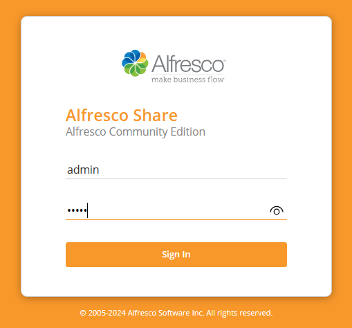

This console is where you will be able to check that the sample files are indeed created in the EDM folders. This is also where you can add metadata schemas, and generally speaking realize administration operations on the CMIS-compatible server. The very first thing to do is to create a receiving folder under the root of the repository you just logged in. To do so, go to `My files`, and click on `Create...` then `Folder`:

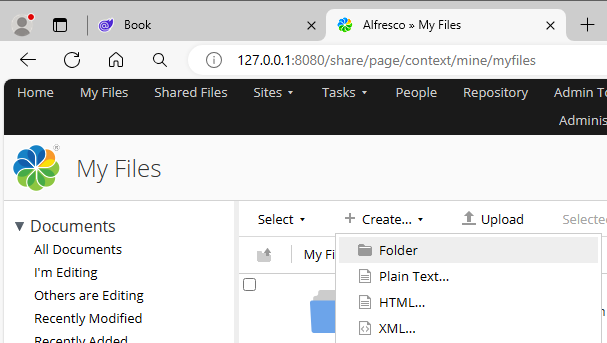

For the examples below to work, this folder needs to be named precisely `DemoEditor`:

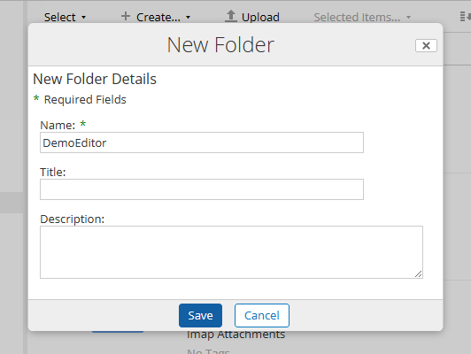

After that, we need to execute a second, a bit more complex, administration operation. If you go to `Admin tools` and `Model Manager`, you will see the following interface that will allow you to import a metadata schema:

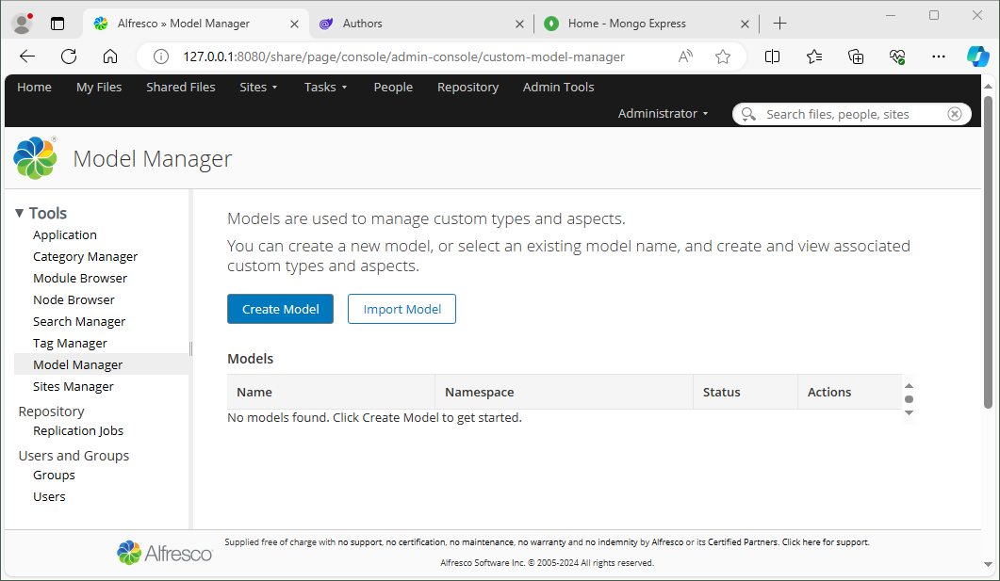

A `DemoEditor.zip` Custom Module Manager is provided in the `resources` folder for your convenience. It contains a few metadata definition for the type of document that we will use in this sample, namely an authoring contract. Once imported, you need to activate the model:

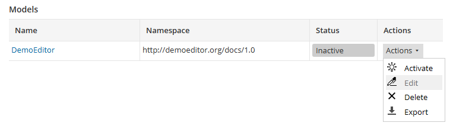

Clicking on the `DemoEditor` link will show you the content:

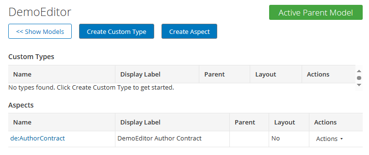

And going inside the `de:AuthorContrat` will list the associated metadata for this type of document:

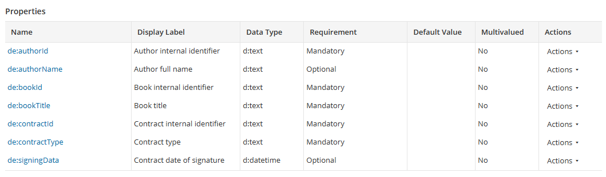

The `Action` menu allows for edition of these metadata fields. For example, on the `de:contractType`, we could specify a constraint that only some values are authorized, like this:

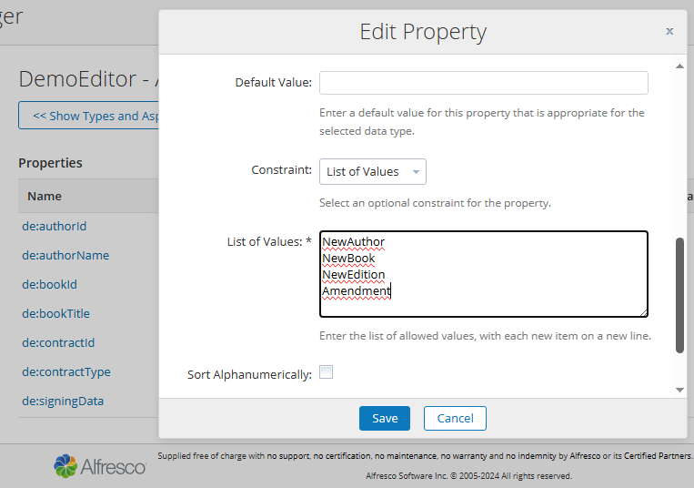

In the same menu, you will find the `Layout designer` that enables the creation of a graphical structure to display the metadata. Here is an example with two columns:

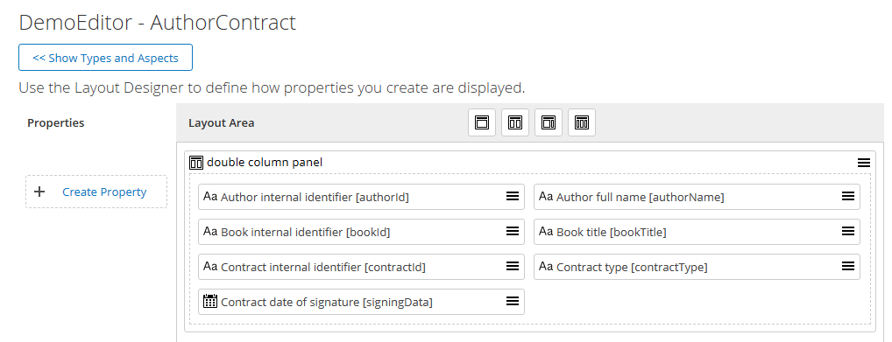

**Please note that this approach with metadata is a bit different from the one shown in the book. For simplicity reason, the section about EDM was reduced in the chapter about external dependencies, and limited the interop to passing URLs of documents (CMIS 1.0). What is even better, because it reduces coupling and makes it as low as possible, is to only depend on this contracts of metadata, by systematically using queries based on them. This way, a client does not call an absolute URL for a document, but instead sends a CMIS query like `{{CMISURL}}?cmisselector=query&succinct=true&q=select * from de:AuthorContract where de:authorId='jpgou'` to the EDM server (whatever implementation of CMIS 1.1 it is) and retrieves the associated documents.**

The EDM system should now be ready for use in the Information System business processes managing electronic documents (contracts, in this case), but a quick test on Postman, using the dedicated `Documents` folder, will allow you to check everything is in place. You may need to adjust the `CMISURL` environment setting, using the URL provided in the Alfresco parameters, under `CMIS 1.1 Browser Binding URL`:

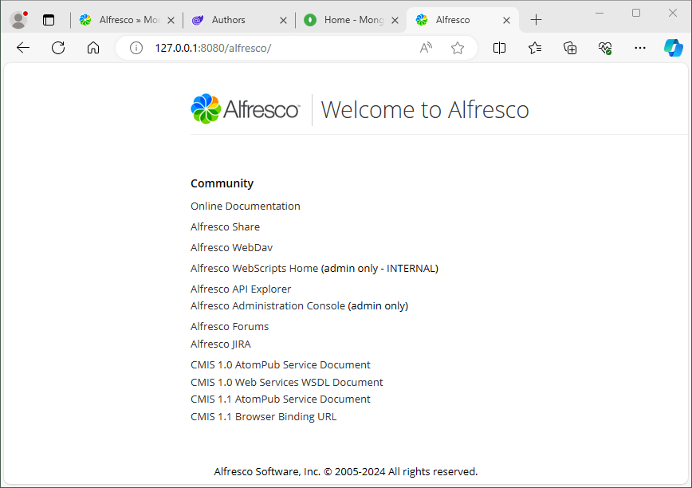

## Defining IAM

The Identity and Authorization Management server (Apache Keycloak, in our case) has been activated in the Docker Compose service for this version, and must be configured:
1. Connect to http://iam:8088/admin/master/console/, using the credentials defined in the `docker-compose.yml` file.
2. Create a realm called `demoeditor`.
3. Add 3 realm roles, named `editor`, `director` and `author`.
4. Create a client with `portal` as its id, and use default in the `Capability config` tab of the wizzard.
5. In the following step, add the login-callback, logout-callback and web origins for localhost, but also ports 81 and 82.

The content should be like follows (the ports are the one inside Docker Compose, not the exposed ones):

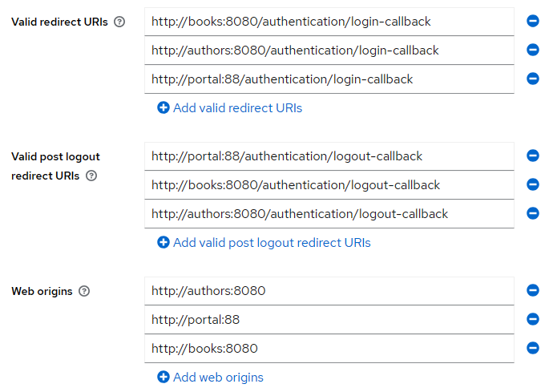

6. Click the `portal-dedicated` link in the `Client scopes` tab.
7. Add the predefined mapper called `realm roles`.
8. In this new mapper, activate the `Add to ID token` setting.
10. Add a `francesca` user.
11. Assign this account the `director` role.

Note that an export of the realm settings is provided in the `resources` folder, to speed up the process (to import, browse the file when in the `create realm` command; you will need to re-create the users, though). In a following version (which means another branch of this repository), we will also harden a bit the IAM, with an appended database to store setting in a persistant manner.

## Injecting some data

The files [DemoEditor.postman_collection.json](resources/DemoEditor.postman_collection.json) and [DemoEditor.postman_environment.json](resources/DemoEditor.postman_environment.json) can be imported into Postman to respectively create a collection of API calls and an environment, both called `DemoEditor`. You will find in the collection some operations to create sample data:

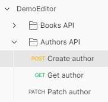

Using the `DemoEditor` is needed to point correctly to the API implementations:

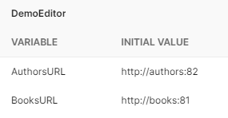

The commands use the variables of the environment in order for you to quickly adapt to your own setting. I recommend you run at least the `Create author` and `Create book` operations:

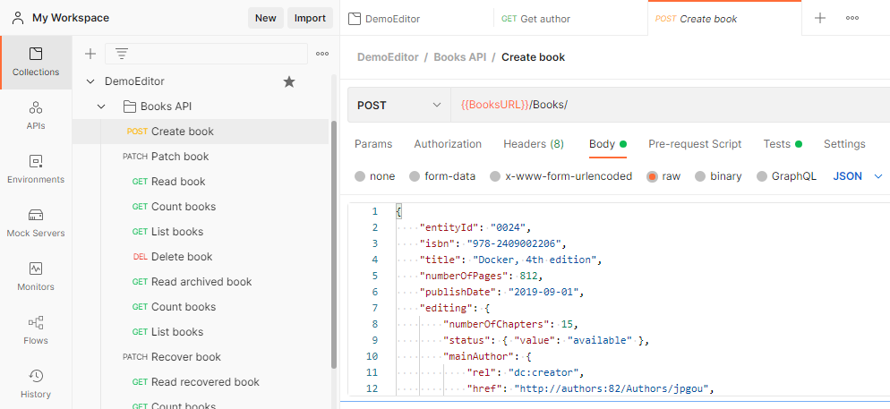

Since we have activated authentication and authorization in this version, it is necessary to edit the `Authorization` parameters of the `DemoEditor` collection (all levels below inherit from it), and obtain an OAuth 2.0 token, with such a configuration to retrieve it from Keycloak (check the book for all details):

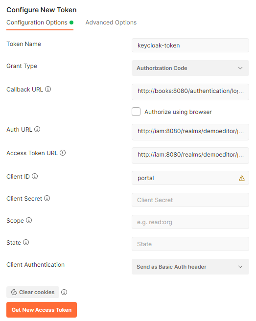

## Batch import of data

Sending data by hand is not very effective, so we will take advantage of the `import` volume declared in the Docker Compose file and use the following command to load the Excel workbook provided in the folder called `resources` (note that all commands are provided Linux-style; if you are using Windows, please operate them through WSL):

```
docker run --rm -v ./resources/DemoEditor-BooksCatalog.xlsx:/tmp/DemoEditor-BooksCatalog.xlsx -v demoeditor_import:/tmp/data ubuntu cp /tmp/DemoEditor-BooksCatalog.xlsx /tmp/data
```

Once this is done, you may use the following Postman operation to integrate the content from the Excel workbook:

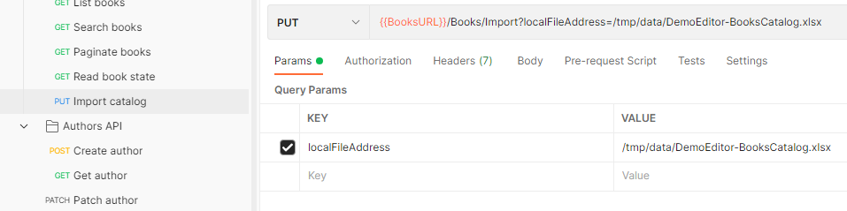

A GUI to inspect content of the MongoDB database is also provided in this version, with credentials visible in the `docker-compose.yml` file to connect to such an interface:

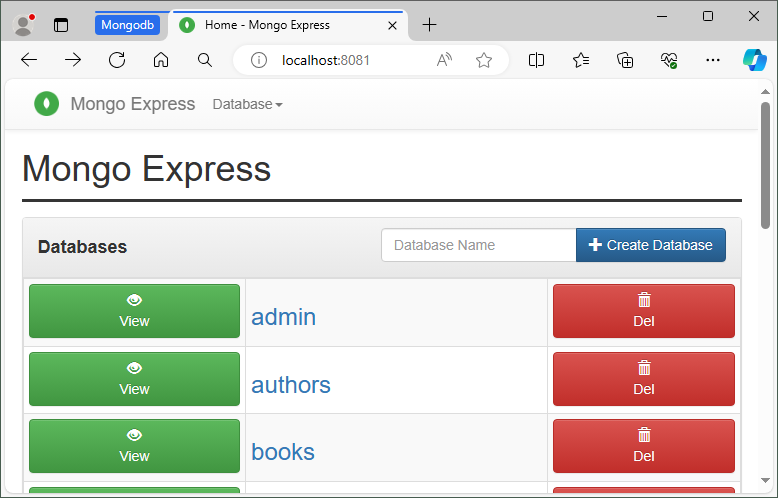

## Defining the middle office behaviour

In order for the middle office to work properly, it is necessary to create a template definition, by using the Postman collection, and in particular the `Declare template` operation under folder `MiddleOffice`:

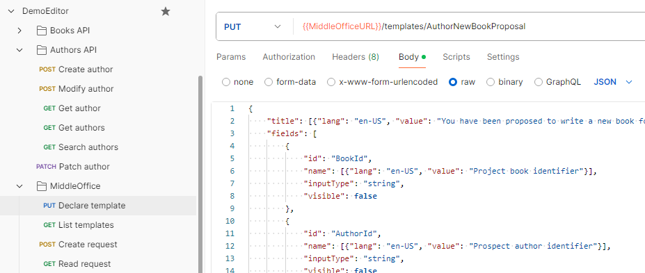

## Running the application

Going to `http://portal:88` should provide the following interface (if an error occurs, check the 88 port is not already used in another process):

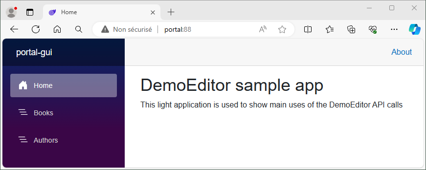

Most menus are invisible, until you click on `Log in` and connect using the `francesca` user that has been created above, and who have most accesses, owing to her `director` role:

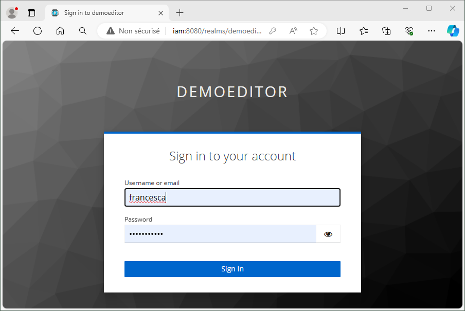

Clicking on the `Books` menu brings you to the list of books in the dedicated service:

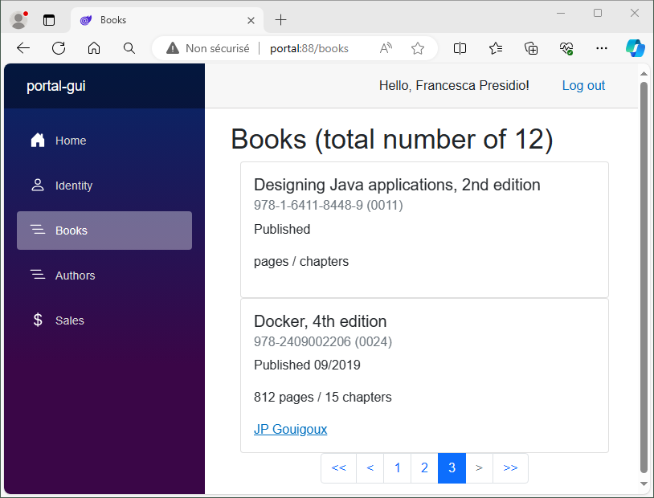

From there, you can reach the author's edition form:

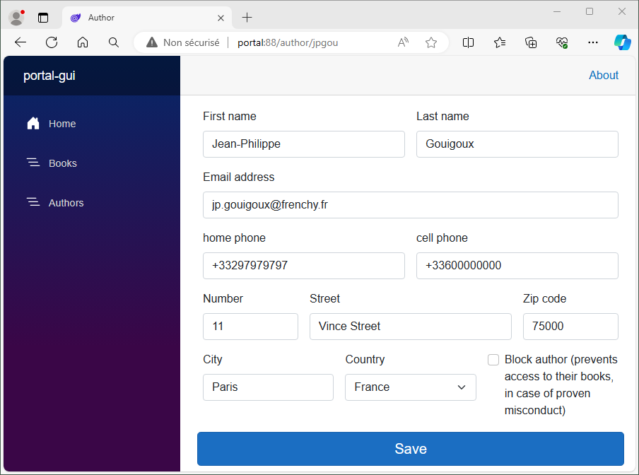

It is also possible to access the authors from the dedicated list (`Authors` menu):

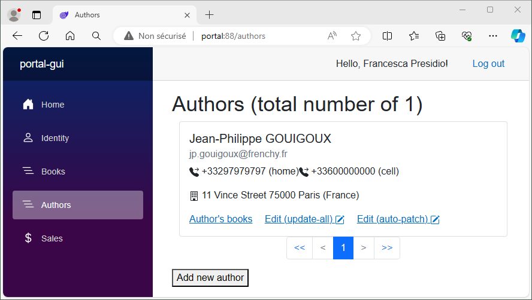

This interface allows you to edit authors with the auto-patch method (see the book for more information):

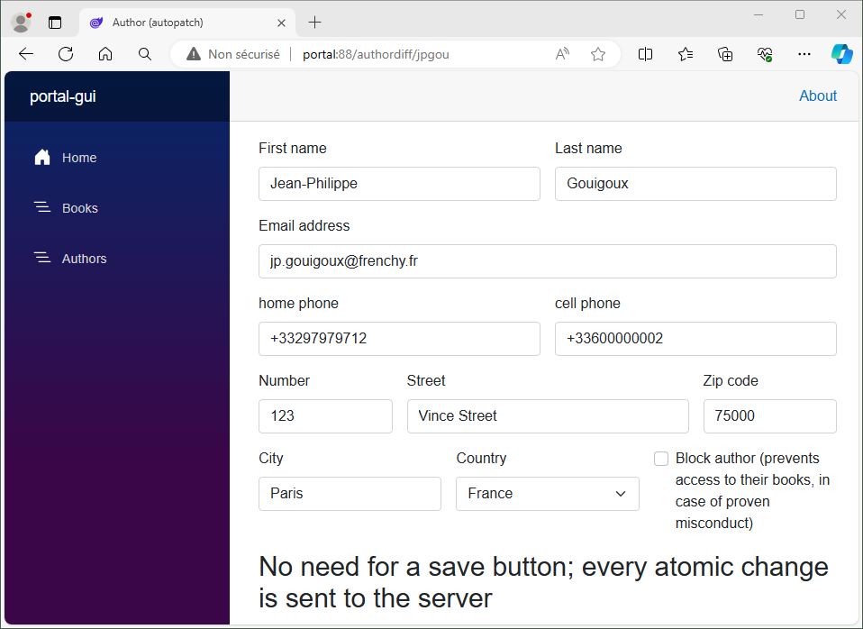

If you log out, create a user with a simple `editor` role, which provides fewer accesses (or even `author`, which has almost no rights), then log in again using this new user, you will notice some menus do not appear. In addition, trying to enter the URL directly will not help and you will be rejected anyway:

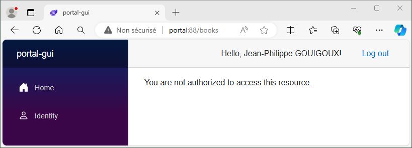

And that's about it for this second version of the sample application. The evolution to a secured system has been realized without touching any of the business function, but that sounds logical. The real test of the architecture will be when adding some business-related features, which will be the subjects of the following versions (see other branches of the repository).

## Executing the book creation process

Still in the portal, under the `Books` menu, click on the `Start project for a new book`. This should bring you to a form where you will be able to progress step by step in a book creation:

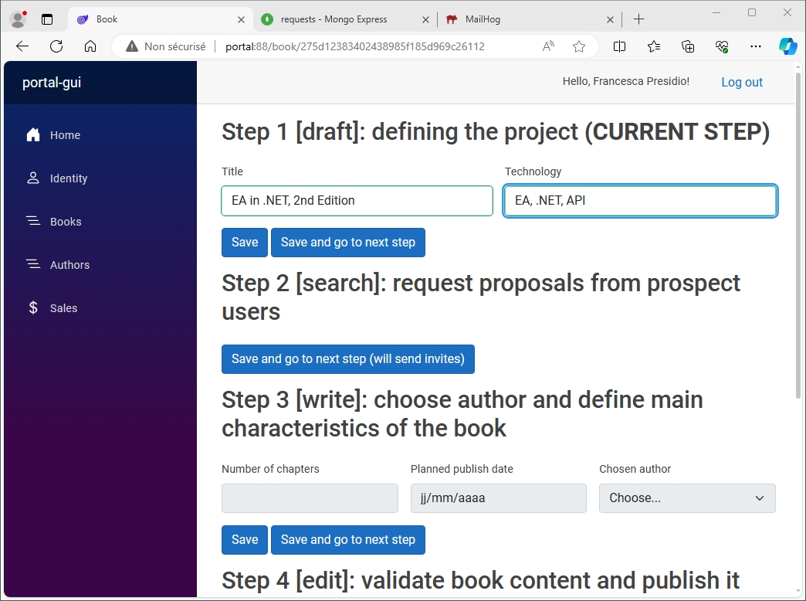

When in second step, you should drag and drop some authors to send them an invite:

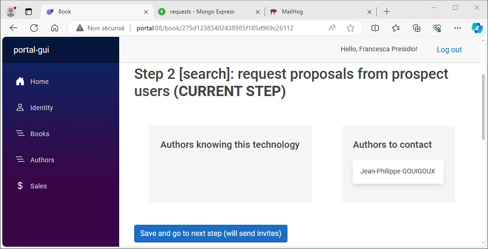

Once the choice is validated, the process integrated in the API will create a request in the middle office service and send an invite to the authors. The invite can be found in the mail server:


The content of the mail is the form coming from the middle office:

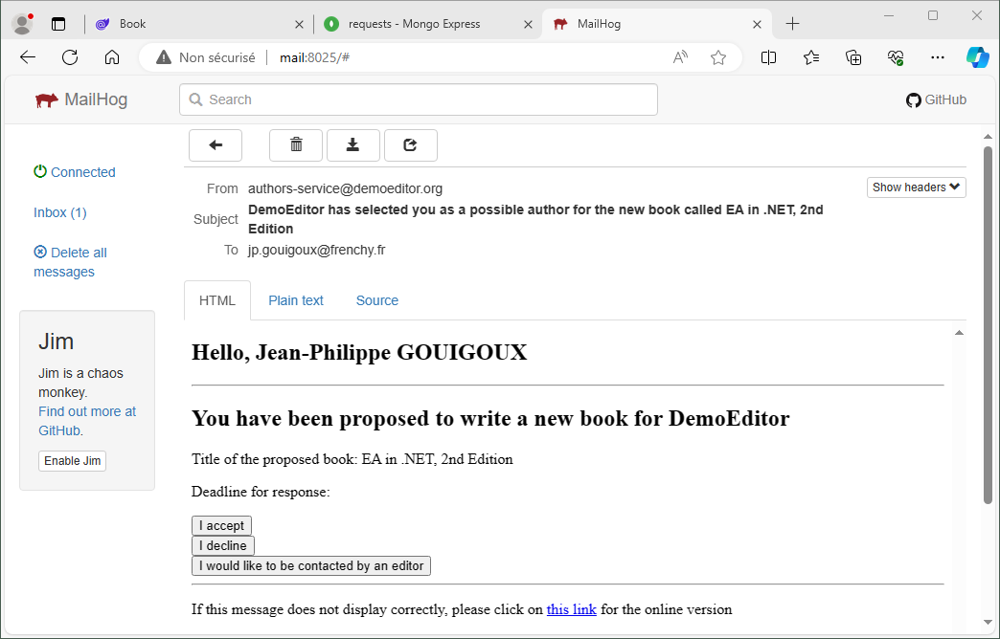

If you click on the first button, another mail will be sent explaining the author has accepted the proposal. There is no action attached to the second choice. Finally, the third choice will send a mail to the editors in order to ask them to call the author:

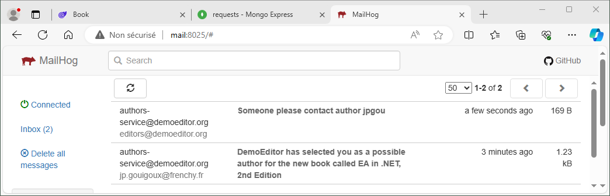

## Notes

All projects for the sample Information System have been provided in a single repository, with all versions aligned to the branches of this repository. In a real production context, they would have been completely separated, the only link remaining being the `common` project, which only carries contracts-related objects. And even this is questionable if you want to reach complete version decoupling. It should at least be provided in versioned components, each service being responsible for using the right version of the entities.