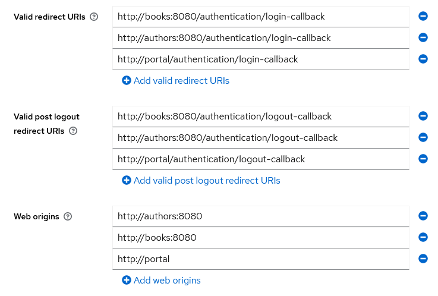

# Enterprise Architecture with .NET
Enterprise Architecture with .NET, published by Packt

## Content
This repository contains the sample application used in the Packt book

## Installation
Example exposed on localhost to avoid HTTPS setup complexities (any real domain, even when simply aliased in the hosts file, would trigger HTTPS redirection on modern browsers)
127.0.0.1 iam
127.0.0.1 portal
127.0.0.1 authors
127.0.0.1 books

## IAM
Create a demoeditor realm
Add author, editor and director realm roles
Add a `francesca` user, with director role
Create a client with ID `portal` and use default settings in the `Capability config` tab of the wizzard
Add the login-callback, logout-callback and web origins for localhost, but also ports 81 and 82
Add the realm role mapping to the portal-dedicated client scope + add to ID token

(or use the file to import the realm)

## Running portal

If you have a 404, change port to another, like 88 (do not forget to adjust CORS settings in books and authors)

https://code-maze.com/using-access-token-with-blazor-webassembly-httpclient/

If you have WASM hosted then you'd be better off using BFF (Backend for Frontend) and sticking to Cookies with Samesite. This below video explains the pattern and why tokens are not a good approach in a new app. (https://www.youtube.com/watch?v=DdNssiaIY_Q)

